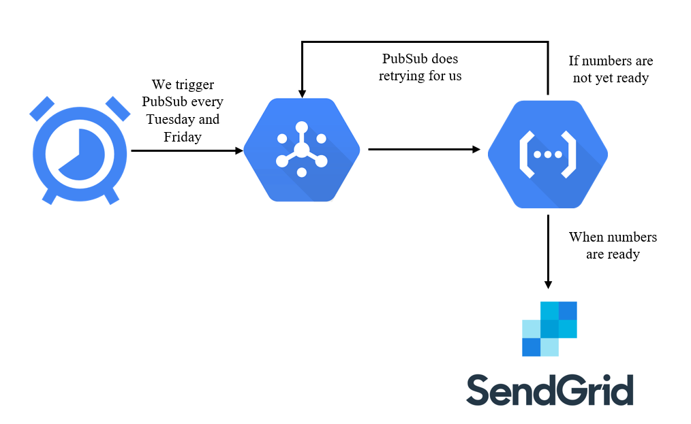

# EuroJackpot scraper

## Background and description of the problem
My grandmother really likes to play EuroJackpot, because she hopes that she will become a millionaire one day. But she also wants to know EuroJackpot numbers on the day that they are drawn. The problem is that in Slovenia numbers are available at around 23:00, and she does not want to stay up so long. It turns out that on some foreign page, drawn numbers are already available sooner, but the time that they are available varies: from 20:15 to 21:15. Therefore, it would be best that my grandmother gets to know them as soon as possible so that she can either start to spend money or that she can go to bed. But the problem is that my grandmother is old and cannot speak English or use the Internet. 

I really did not want to manually check every 5 minutes if the numbers are ready. Therefore, I wrote a "scraper" that does that for me and that I can enjoy my evenings without hitting that refresh button 10 times.

## Design

Main objective of the scraper is to retrieve new EuroJackpot numbers and send them to recipients email. Since numbers can be ready at any moment after 20:15 and we also need to get them as soon as possible we need some sort of retrying mechanism.

I decided to put my scraper in a simple Google Cloud Function, that is triggered by PubSub, which is triggered by Cloud Scheduler. When numbers are ready we send numbers with SendGrid. Whole scheme can be seen in the figure below:

## Implementation

Scraper's implementation is really simple. It checks if there are drawn numbers on the page for today. If there are, it extracts the numbers, crafts an email and send it using SendGrid Python client library. If the numbers are not ready it raises the error so that PubSub will retry the retrieving process. Retying is therefore implemented with infrastructure and we do not need to worry about it in the code.

Since I use Google's managed solutions in order to not have any work with maintaining the infrastructure, I run all on Google Cloud Platform. I also needed to create an email account on ProtonMail so that I have an account from which I can send the email. In order to send email I also needed to configure SendGrid and connect it to my sender's email.

Sender's email and recipients are saved to environment variables and SendGrid API key is saved to Google Secret Manager.

## Deployment

Project has CI/CD pipeline so that I can redeploy changed scraper with pushing to `main`. Pipeline creates Cloud Function, deploys code on it, injects the environment variables, injects secret from Secret Manager and configures PubSub trigger with retry.